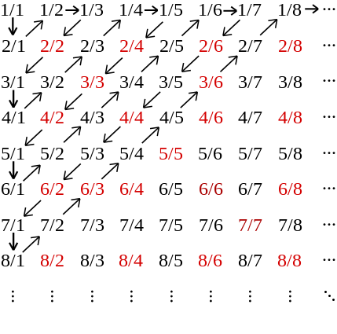

Zbiory przeliczalne i ich przykłady.

---

# Równoliczność
Zbiory $A$ i $B$ nazywamy **równolicznymi**, gdy istnieje bijekcja $f:A\rightarrow B$. Równoliczność zbiorów oznaczamy przez $A  \sim_m  B$.

# Przeliczalność
Zbiór $X$ jest **przeliczalny**, gdy $X \sim_m  N_0$, dla pewnego $N_0 \subseteq \mathbb{N}$. Czyli jest skończony lub równoliczny ze zbiorem liczb naturalnych $\mathbb{N}$.

Intuicyjnie, zbiór przeliczalny to taki, którego elementy można ustawić w ciąg (skończony bądź nie) i wypisać je po kolei.

## Własności
* Każdy podzbiór (nawet nieskończony) zbioru przeliczalnego jest przeliczalny.
* Suma przeliczalnie wielu zbiorów przeliczalnych jest zbiorem przeliczalnym.
* Iloczyn kartezjański skończonej liczby zbiorów przeliczalnych jest zbiorem przeliczalnym.

## Przykłady
Oczywiste przykłady to:

* $\mathbb{N}$,
* Dowolny zbiór skończony, np. $\{ e, \pi \}$,
* Zbiór pusty $\emptyset$.

### Zbiór liczb nieparzystych
Ponieważ funkcja $f(n) = 2n + 1$ ustala równoliczność zbioru liczb naturalnych ze zbiorem liczb nieparzystych.

### Zbiór liczb pierwszych
Jest (nieskończonym) zbiorem przeliczalnym, jako podzbiór zbioru liczb naturalnych.

### Zbiór liczb całkowitych
Można liczby całkowite ustawić w ciąg, na przykład w ten sposób: $$0, 1, -1, 2, -2, 3, -3, 4, -4, 5, -5, ...$$

### Zbiór liczb wymiernych
Wystarczy, że pokażemy to dla liczb wymiernych dodatnich, bo wtedy dowód dla wszystkich liczb wymiernych będzie analogiczny jak dla liczb całkowitych. Aby to udowodnić wystarczy wszystkie liczby wymierne wpisać do kwadratowej tablicy (jak poniżej). Otrzymujemy tym samym uporządkowanie wszystkich liczb wymiernych w ciąg – co więcej, każda liczba wymierna pojawi się w tym ciągu nieskończenie wiele razy - otrzymamy w ten sposób surjekcję z $\mathbb{N}^2$ w $\mathbb{Q}$.

