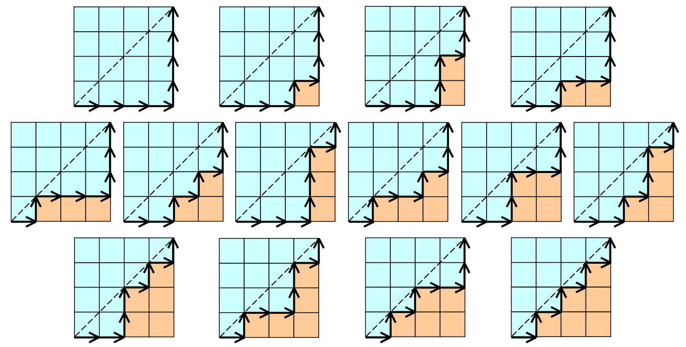

Metoda funkcji tworzących, liczby Fibonacciego, Catalana, Stirlinga i Bella.

---

# Funkcje tworzące
Narzędzie stosowane między innymi do rozwiązywania równań rekurencyjnych i opisywania ciągów liczbowych. Funkcja tworząca $G(x)$ ciągu współczynników ${g_n} = g_0, g_1, g_2,...$ to **szereg,** gdzie $n$-ty współczynnik stoi przy wyrazie $x^n$.

$$G(x) = \sum^{\infty}_{n=0} g_n x^n.$$

# Liczby Fibonacciego
$$\begin{align}
f_0 &= 0; f_1 = 1;\\
f_{n} &= f_{n-1} + f_{n-2}.
\end{align}$$

# Liczby Catalana
$$\begin{align}
C_0 &= 1;\\
C_{n+1} &= \sum^{n}_{i=0} C_iC_{n-i}
\end{align}$$

Jeżeli rozpatrzymy wszystkie możliwe drogi w kwadracie $n \times n$ z dolnego lewego wierzchołka do górnego prawego, tak, by nigdy nie przekroczyć przekątnej łączącej te wierzchołki i były monotoniczne, łatwo jest zauważyć, że wyrażają się one $n$-tą liczbą Catalana.

# Liczby Stirlinga

## Pierwszego rodzaju
Na ile sposobów można rozmieścić $n$ liczb w $k$ cyklach permutacji.

$$
{n \brack k} = {n-1 \brack k-1} + {n-1 \brack k}(n-1),
$$

gdzie

$$
{n \brack n} = 1, {n \brack 0} = 0, {0 \brack 0} = 1.
$$

Dlaczego tak? Rozważmy $n$-tą liczbę. Są dwa przypadki.

1. Może sama tworzyć cykl długości $1$. Czyli do rozstawienia pozostaje $n-1$ liczb na $k-1$ cyklach (${n-1 \brack k-1}$).

2. Albo może należeć do jakiegoś dłuższego cyklu. Wtedy rozstawiamy $n-1$ liczb na $k$ cyklach (${n-1 \brack k}$) i wybieramy jedną z $n-1$ liczb, za którą dodamy wyróżnioną liczbę (stąd czynnik $(n-1)$).

## Drugiego rodzaju
Na ile sposobów można podzielić zbiór $n$-elementowy na $k$ niepustych podzbiorów.

$$
{n \brace k} = {n-1 \brace k-1} + {n-1 \brace k}k,
$$

gdzie

$$\begin{align}
{n \brace 1} = 1, {n \brace n} = 1;\\
{n \brace k} = 0 \text{ dla } k > n
\end{align}$$

Są znowu dwa przypadki:

1. Liczba może należeć do jednoelementowego zbioru, więc zostaje ${n-1 \brace k-1}$.

2. Albo może być w którymś z innych zbiorów. Czyli dzielimy $n-1$ liczb na $k$ zbiorów i wybieramy do którego dorzucimy wybraną liczbę: $k{n-1 \brace k}$.

## Liczby Bella
$B_n$ to liczba podziałów zbioru $n$ elementowego. Z liczb Stirlinga drugiego rodzaju: $$B_n = \sum^n_{k=0} {n \brace k}$$

# Rozwiązywanie rekurencji za pomocą funkcji tworzących

## 1. Wyrażenie równania rekurencyjnego przy pomocy szeregu (funkcji tworzącej)

Weźmy nasze wejściowe równanie rekurencyjne

$$\begin{align}
f_0 &= 0; f_1 = 1;\\
f_{n} &= f_{n-1} + f_{n-2}.
\end{align}$$

Naszym celem jest uzyskanie funkcji tworzącej:

$$F(x) = \sum^{\infty}_{n=0} f_n x^n$$

W tym celu mnożymy wszystkie równości stronami przez $x^n$ i sumujemy dla wszystkich $n$. Dostajemy

$$\begin{align}
F(x) &= \sum^{\infty}_{n=0} f_nx^n \\
&= 0x^0 + 1x^1 + \sum^{\infty}_{n=2} (f_{n-1}x^n + f_{n-2}x^n)\\
&= x + x\sum^{\infty}_{n=2}f_{n-1}x^{n-1} + x^2\sum^{\infty}_{n=2}f_{n-2}x^{n-2}\\
&= x + x\sum^{\infty}_{n=0}f_{n}x^{n} + x^2\sum^{\infty}_{n=0}f_{n}x^{n}\\
&= x + xF(x) + x^2F(x)\\
&= \frac{x}{1 - x - x^2}.
\end{align}$$

W trzeciej linijce w pierwszej sumie mogliśmy dodać wyraz dla $n=0$ (normalnie powinniśmy zacząć sumowanie od $n=1$) bo $f_0x^0 = 0$.

## 2. Obliczenie postaci zwartej szeregu

Gdy popatrzymy na tabelkę z najważniejszymi szeregami potęgowymi (następny rozdział) to zobaczymy, że tak naprawdę szukając postaci zwartej szukamy ułamków prostych z mianownikiem postaci $\frac{1}{1 - \rho x}$. Rozkładamy mianownik:

$$
1-x-x^2 = (1 - \varphi_1x)(1 - \varphi_2x)
$$

z czego szybko dostajemy (proste równanie kwadratowe), że $\varphi_1 = \frac{1+\sqrt{5}}{2}$, $\varphi_2 = \frac{1-\sqrt{5}}{2}$.

Będziemy chceli rozłożyć $F(x) = \frac{x}{1-x-x^2}$ na  $\frac{A}{1-\varphi_1x} + \frac{B}{1-\varphi_2x}$.

$$\begin{align}
F(x) &= \frac{x}{1-x-x^2} = \frac{A}{1-\varphi_1x} + \frac{B}{1-\varphi_2x}\\
x &= A(1-\varphi_2x) + B(1-\varphi_1x)\\
x &= A + B - x(A\varphi_2 + B\varphi_1)\\
\text {Dostajemy } A &= \frac{1}{\sqrt{5}}, B = -\frac{1}{\sqrt{5}}\\
F(x) &= \frac{\frac{1}{\sqrt{5}}}{1-\varphi_1x} - \frac{\frac{1}{\sqrt{5}}}{1-\varphi_2x}.
\end{align}$$

## 3. Rozwinięcie postaci zwartej w szereg
Zaglądamy do tabelki w następnym rozdziale i otrzymujemy:

$$\begin{align}
F(x) &= \frac{1}{\sqrt{5}}\sum^{\infty}_{n=0}(\varphi_1x)^n - \frac{1}{\sqrt{5}}\sum^{\infty}_{n=0}(\varphi_2x)^n\\
&= \frac{1}{\sqrt{5}}\sum^{\infty}_{n=0}(\varphi_1^n -
  \varphi_2^n)x^n.
\end{align}$$

## 4. Wyciągnięcie wzoru zwartego
Zwarty wzór na $n$-tą liczbę Fibonacciego to współczynnik przy $n$-tym wyrazie naszego szeregu. Zatem

$$ f_n = \frac{1}{\sqrt{5}} (\varphi_1^n - \varphi_2^n) = \frac{1}{\sqrt{5}} \left(\left(\frac{1+\sqrt{5}}{2}\right)^n - \left(\frac{1-\sqrt{5}}{2}\right)^n\right).$$

# Najważniejsze szeregi potęgowe

|Ciąg|Funkcja tworząca|Postać zwarta|
|:--:|:--------------:|:-----------:|
|$\displaystyle \langle 0,...,0,1,0,... \rangle$|$\displaystyle \sum_n [n=m]x^n$|$\displaystyle x^m$|
|$\displaystyle \langle 1,1,1,1,... \rangle$|$\displaystyle \sum_n x^n$|$\displaystyle \frac{1}{1-x}$|
|$\displaystyle \langle 1, -1, 1, -1, 1,... \rangle$|$\displaystyle \sum_n (-1)^nx^n$|$\displaystyle \frac{1}{1+x}$|
|$\displaystyle \langle 1,0,1,0,1,... \rangle$|$\displaystyle \sum_n [2/n]x^n$|$\displaystyle \frac{1}{1-x^2}$|
|$\displaystyle \langle 1,2,3,4,5,... \rangle$|$\displaystyle \sum_n (n+1)x^n$|$\displaystyle \frac{1}{(1-x)^2}$|
|$\displaystyle \langle 1,c,c^2,c^3,... \rangle$|$\displaystyle \sum_n c^n x^n$|$\displaystyle \frac{1}{1-cx}$|
