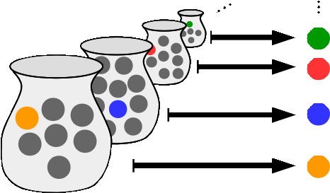

Aksjomatyczne ujęcie teorii mnogości. Aksjomat wyboru.

---

# Aksjomatyczne ujęcie teorii mnogości
Aksjomaty to zdania, z których wynikają wszystkie pozostałe twierdzenia danej teorii. W teorii mnogości przyjęto system **ZFC** - Zermelo-Fraenkela (**ZF**) z aksjomatem wyboru (**AC**):

1. __Aksjomat ekstensjonalności__: dwa zbiory złożone z tych samych elementów są identyczne.
2. __Aksjomat zbioru pustego__: istnieje zbiór pusty.
3. __Aksjomat pary__: dla zbiorów $X$ i $Y$  istnieje zbiór $\{X, Y\}$.
4. __Aksjomat sumy__: dla zbiorów $X$ i $Y$ istnieje zbiór, który zawiera elementy tych zbiorów i żadne inne.
5. __Aksjomat zbioru potęgowego__: dla zbioru $X$ istnieje zbiór, którego elementami są podzbiory zbioru $X$.
6. __Aksjomat nieskończoności__: istnieje rodzina zbiorów $\mathbb{A}$ o następujących własnościach:
* $\varnothing \in \mathbb{A}$,
* jeśli $X \in \mathbb{A}$, to w $\mathbb{A}$ istnieje też element $X \cup \{X\}$.
7. __Aksjomat regularności__: niepusty zbiór posiada element przecinający się pusto z nim samym. Używając aksjomatu regularności można udowodnić, że żaden zbiór nie jest swoim własnym elementem.

# Aksjomat wyboru
Mając rodzinę niepustych rozłącznych zbiorów, możemy stworzyć zbiór, wybierając po jednym elemencie z każdego zbioru.

## Związek z teorią ZF
Aksjomat  **AC** jest niezależny od aksjomatów **ZF**.

Większość matematyków uznaje i stosuje  __AC__, jednak w dowodach twierdzeń zazwyczaj wyraźnie zaznacza się, gdy zakłada się  __AC__. Dowody te nazywa się nieefektywnymi. Zwykle są one także niekonstruktywne, gdy mówią jedynie o istnieniu danego obiektu, jednak nie wskazują go (nie podają konstrukcji).  

## Konsekwencje przyjęcia AC
W przypadku rodzin zbiorów skończonych aksjomat wyboru jest trywialny (tzn. wynika z innych aksjomatów). W przypadku rodzin zbiorów nieskończonych aksjomat  __AC__ również wydaje się intuicyjny. Jednak jego konsekwencje bywają zaskakujące.

### Kula
Stefan Banach i Alfred Tarski, korzystając z  __AC__, udowodnili twierdzenie o paradoksalnym rozkładzie kuli - kulę z trójwymiarowej przestrzeni euklidesowej można rozłożyć na sześć części, a następnie z tych części można złożyć, korzystając wyłącznie z obrotów i przesunięć, dwie kule identyczne jak kula wyjściowa.
